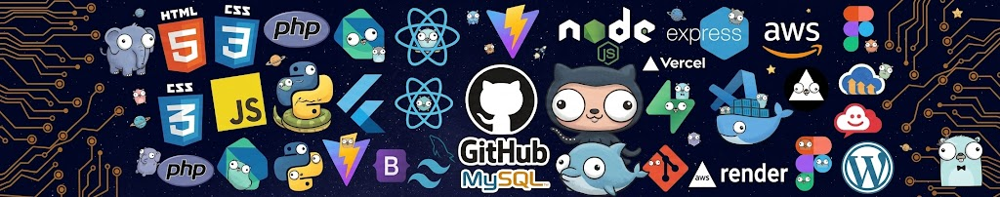

   
<!--    -->
  

<h2>👋 About Me</h2>

`Hi, I'm Angelito P. Decatoria III, an aspiring Software Engineer and Computer Science student passionate about building modern and user-friendly applications. I enjoy turning ideas into software while continuously improving my skills through projects and learning.`

`I'm interested in full-stack development, machine learning, and cloud technologies. I love exploring new tools, solving problems, and creating projects that help me grow as a developer.`

`When I'm not coding, you'll probably find me playing Valorant or exploring new technologies.`

<h3>💻 Technologies and Tools</h3>

<table>
<tr>

<td valign="top" width="50%">

<h6>👨‍💻 Programming and Markup Languages</h6>

</td>

<td valign="top" width="50%">

<h6>🚀 Frameworks & Libraries</h6>

</td>

</tr>

<tr>

<td valign="top" width="50%">

<h6>🗄️ Databases & Backend Services</h6>

</td>

<td valign="top" width="50%">

<h6>🛠️ Software & Tools</h6>

</td>

</tr>

<tr>

<td valign="top" width="50%">

<h6>🤖 AI & Machine Learning</h6>

</td>

<td valign="top" width="50%">

<h6>☁️ Deployment & Cloud</h6>

</td>

</tr>

</table>

<h3>🏷️ Holopin Badges</h3>

